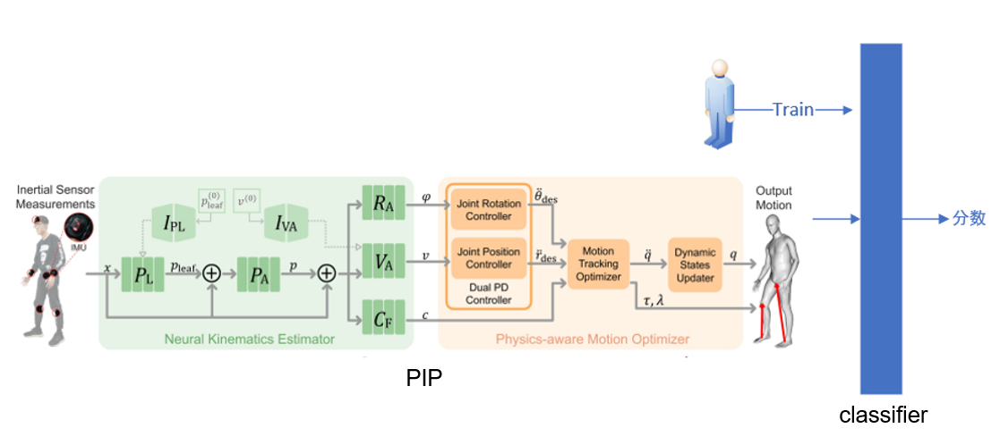

# 简介

本次项目基于[PIP](https://github.com/Xinyu-Yi/PIP)模型用于对运动员运动姿势的捕捉，并在模型后面再训练一个分类头，用于对运动姿势的评价。

# 配置环境

首先需要配置PIP的运行环境，原作者推荐是在linux配置，因为在windows环境更麻烦。linux环境有多种选择，1.虚拟机；2.wsl；3. 双系统。wsl全称是Windows Subsystem for Linux（WSL），是微软在 Windows 平台下支持 Linux 环境的子系统，可以直接在windows桌面运行linux系统，感觉比虚拟机方便很多，双系统没有了解太多，所以我采用了第二种方法。我的主机系统是win10，安装步骤可以参考这篇博客[windows10安装wsl2](https://www.jianshu.com/p/be669d9359e2)，遇到问题可自行在再网上搜索其他博客，记住一定要安装wsl2而不是wsl，因为我一开始也是安装wsl，后面发现无法运行命令nvidia-smi，然后在网上搜了很久都没有找到具体回答，我推断是wsl显卡驱动版本和windows的不匹配，然后升级为wsl2后就可以运行了。然后linux内核选择的是ubuntu 18.04.5。
然后接下来就是一堆库的安装，这些库都是PIP这个方法要调用的，过程中可能会遇到很多问题，一定要耐心安装。PIP的github仓库里也有安装步骤，但是不够详细。

## 1.在wsl中安装anaconda

pip要求的使用的python版本是3.7.6，但是ubuntu18.04.5自带的python版本是3.9的，一开始懒得装anaconda，想能不能直接重装ubuntu的python，但是据我上网搜索了解，这个是一个极其困难的问题，因为ubuntu自身也使用到了一些python的库，要是重装可能造成不可预测的后果。anaconda可以创建多个虚拟环境，每个环境都可以有自己的python以及python库，方便管理，anaconda的安装可以参考[Ubuntu在Anaconda中创建虚拟环境并安装pytorch](https://blog.csdn.net/JACKZHOU8/article/details/127338038)，后面安装pytorch的过程，pytorch如果想问访问GPU，需要安装好cudnn和cuda，安装方法在安装wsl2链接中。在安装好anaconda之后，可能出现这个问题[ubuntu安装anaconda后输入conda显示command not found](https://blog.csdn.net/qq_33346150/article/details/110056013)。按照博客里的内容激活虚拟环境就可以在这个虚拟环境中安装python的库，如果有什么问题删掉这个虚拟环境重装就好，这样就方便管理很多。

## 2.在anaconda创建的虚拟环境中安装rbdl

rbdl是一个动力学库，在PIP方法的第二部分也就是物理优化部分用到很多，官网也有安装教程

