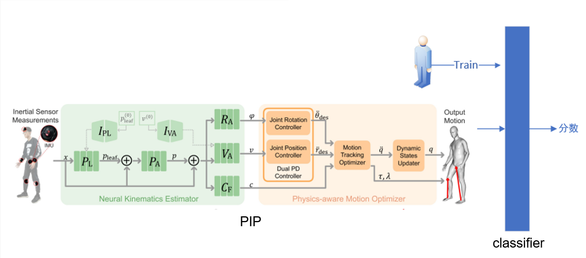

# 简介

本次项目基于[PIP]([()](https://github.com/Xinyu-Yi/PIP))模型用于对运动员运动姿势的捕捉，并在模型后面再训练一个分类头，用于对运动姿势的评价。

# 配置环境

首先需要配置PIP的运行环境，原作者推荐是在linux配置，因为在windows环境更麻烦。linux环境有多种选择，1.虚拟机；2.wsl；3. 双系统。我采用了第二种方法，安装步骤如下：

